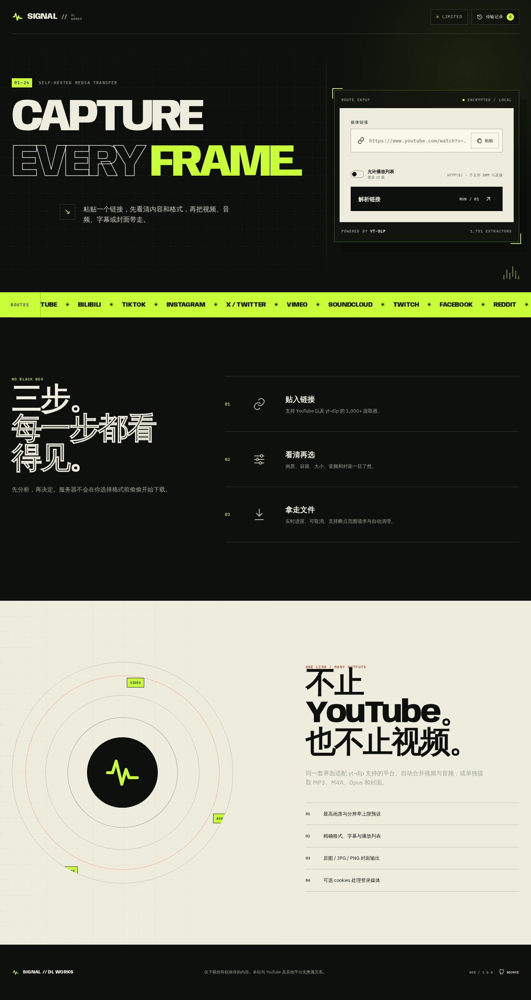
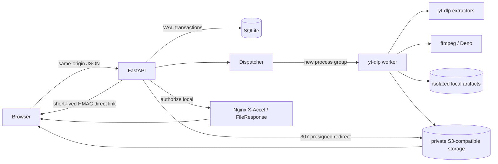

# SIGNAL / yt-dlp Web

<p align="center">
  <strong>一个可部署到 Debian VPS 的自托管多平台媒体下载工作台。</strong><br>
  粘贴链接 → 查看元数据与格式 → 下载视频、音频、字幕或封面。
</p>

<p align="center">
  
</p>

[](https://github.com/sdxdlgz/ytbdownload/actions/workflows/ci.yml)

> 本项目调用 [yt-dlp](https://github.com/yt-dlp/yt-dlp) extractor。它不是 YouTube 官方产品，也与任何媒体平台无隶属关系。请只下载你有权保存的内容，并遵守来源平台条款与所在地法律。

## 功能

- **先分析再下载**：显示标题、作者、时长、封面、来源平台、字幕和可用格式。
- **视频输出**：最佳画质、2160p/1440p/1080p/720p/480p/360p 上限、精确 format ID；自动用 ffmpeg 合并音视频。
- **音频输出**：MP3、M4A、Opus。
- **封面输出**：原图、JPG、PNG，可独立下载。
- **多平台**：不写死 YouTube；当前 yt-dlp 安装可加载约 1,700 个 extractor，包括 Bilibili、TikTok、Instagram、X/Twitter、Vimeo、SoundCloud、Twitch、Facebook、Reddit 等。
- **有限播放列表**：显式开启、硬上限、自动 ZIP，同时保留单项文件。
- **可选对象存储**：完成产物可事务式上传到私有 AWS S3、Cloudflare R2、Backblaze B2、Wasabi 或 MinIO；支持 multipart、SSE、失败回退与远端清理 outbox。
- **临时签名直链**：LOCAL/S3 均可生成免 Cookie 的短期 HMAC URL，支持 GET/HEAD/Range，可直接交给 IDM/aria2。
- **字幕与元数据**：手动/自动字幕选择，ffmpeg 媒体标签。
- **真实任务状态**：持久队列、下载进度、速度、ETA、后处理阶段、取消、历史记录、Range 文件发送、TTL 清理。
- **可选私有访问**：共享强令牌换取 HttpOnly / SameSite=Strict Cookie。
- **VPS 防护**：初始 URL SSRF 检查、Host/Origin 校验、限流、并发/大小/时长/磁盘上限、独立 worker 进程组、超时 TERM→KILL、可选 nftables egress。
- **部署齐全**：Docker Compose + Caddy 自动 HTTPS，或原生 systemd + Nginx `X-Accel-Redirect`。

## 快速开始（本地开发）

### 依赖

- Python 3.11+
- ffmpeg / ffprobe
- Deno（YouTube 完整格式强烈建议）

```bash
git clone git@github.com:sdxdlgz/ytbdownload.git
cd ytbdownload

python3 -m venv .venv
.venv/bin/python -m pip install --upgrade pip
.venv/bin/pip install -e '.[test]'

cp .env.example .env
sed -i "s/CHANGE_ME_LONG_RANDOM_TOKEN/$(python3 -c 'import secrets; print(secrets.token_urlsafe(32))')/" .env
sed -i "s/CHANGE_ME_DIFFERENT_RANDOM_SECRET/$(python3 -c 'import secrets; print(secrets.token_hex(32))')/" .env
# 本地 HTTP：
sed -i 's/YTDLP_WEB_COOKIE_SECURE=true/YTDLP_WEB_COOKIE_SECURE=false/' .env
sed -i 's|YTDLP_WEB_DATA_DIR=/data|YTDLP_WEB_DATA_DIR=./data|' .env

.venv/bin/python -m uvicorn app.main:app --host 127.0.0.1 --port 8000 --no-access-log
```

打开 <http://127.0.0.1:8000>。

> `.env.example` 的 `CHANGE_ME` 只是占位符，production 模式会拒绝带占位符或过短的 token 启动。即使本地运行也应换成随机 token/secret；完全不需要鉴权时可把 `YTDLP_WEB_ACCESS_TOKEN` 留空。

## Debian VPS 部署

### 方式 A：原生一键安装

在已通过 SSH clone 的源码目录执行：

```bash
sudo ./scripts/install-debian.sh \
  --domain dl.example.com \
  --email admin@example.com

sudo cat /root/ytbdownload-access-token.txt
systemctl status ytbdownload --no-pager
```

安装器创建专用系统用户、venv、Deno、systemd sandbox、Nginx、Let's Encrypt 证书和随机访问令牌。

更新：

```bash
./scripts/update-debian.sh
```

更新脚本会验证 `origin` 是 SSH URL，只做 fast-forward pull，然后复用之前的安装配置。

### 方式 B：Docker Compose + Caddy

```bash
cp .env.example .env
# 编辑 token、secret、allowed hosts，并设置：
# SITE_ADDRESS=dl.example.com
# YTDLP_WEB_ALLOWED_HOSTS=dl.example.com,localhost
# YTDLP_WEB_COOKIE_SECURE=true

docker compose -f compose.yml -f deploy/compose.caddy.yml up -d --build
docker compose -f compose.yml -f deploy/compose.caddy.yml ps
```

完整的 DNS、纯 IP、cookies、备份、加固、更新、卸载和故障排查步骤见 **[Debian VPS 部署指南](docs/deployment.md)**。

## 使用流程

1. 粘贴一个公开 HTTP(S) 媒体链接。
2. 如果确实要处理列表，打开“允许播放列表”；默认只分析单媒体。
3. 等待 extractor 返回安全白名单元数据。
4. 在推荐画质、具体格式、音频或封面页签选择输出。
5. 可选字幕/媒体标签，开始任务。
6. 查看真实进度；完成后点击产物下载，或从“传输记录”重新获取。

文件到期后自动删除；默认 TTL 为 12 小时。

## 架构



关键设计：

- **不是线程队列**：每个 yt-dlp 操作在新进程组中运行，取消/超时时连同 ffmpeg 子进程一起终止。
- **不是内存任务表**：分析、job、进度、产物都写入 SQLite WAL；重启会协调中断状态。
- **不接受任意 yt-dlp 参数**：浏览器只提交后端生成的 opaque choice ID；worker 重新提取并检查媒体身份/格式。
- **不暴露原始 info dict**：只返回字段白名单，排除直链、headers、cookies、fragment。
- **固定磁盘路径**：输出模板与磁盘文件名由应用控制，展示标题只用于安全的 Content-Disposition 名称。
- **S3 不做半套切换**：对象 key 会先持久化，全部 PUT + HEAD 校验成功后一次事务切换 backend；失败可完整回退本地。
- **删除先撤权再出队**：清理会原子撤销 artifact/直链并写入 durable S3 deletion outbox，网络删除失败指数退避；bucket lifecycle 是第二道保障。

> 当前 dispatcher 设计要求每个部署只运行 **1 个 Uvicorn API worker**。媒体并发由 `YTDLP_WEB_MAX_CONCURRENT_OPERATIONS` 控制。要水平扩展时应迁移到 PostgreSQL + 独立队列系统。

## API 概览

| 方法 | 路径 | 说明 |
|---|---|---|
| `GET` | `/api/v1/config` | 公开能力、版本、上限（无密钥） |
| `GET` | `/api/v1/health/live` | 进程存活 |
| `GET` | `/api/v1/health/ready` | DB、存储、ffmpeg、Deno、yt-dlp |
| `POST` | `/api/v1/auth/session` | 访问令牌换 HttpOnly 会话 |
| `POST` | `/api/v1/analyses` | 创建异步媒体分析 |
| `GET` | `/api/v1/analyses/{id}` | 轮询元数据/choices |
| `POST` | `/api/v1/jobs` | 用 analysis + choice 创建任务；支持 `Idempotency-Key` |
| `GET` | `/api/v1/jobs` | 当前 principal 的历史记录 |
| `GET` | `/api/v1/jobs/{id}` | 进度、阶段、错误、产物 |
| `DELETE` | `/api/v1/jobs/{id}` | 活动任务取消；终态任务立即清理 |
| `GET/HEAD` | `/api/v1/artifacts/{id}` | 鉴权下载，支持 Range |
| `POST` | `/api/v1/artifacts/{id}/direct-links` | 鉴权生成短期免 Cookie HMAC 直链 |
| `GET/HEAD` | `/d/{id}?expires=...&signature=...` | 本地 Range 文件或 S3 method-specific 307 |

OpenAPI JSON：`/api/v1/openapi.json`。

## 主要配置

所有应用变量使用 `YTDLP_WEB_` 前缀。完整模板见 [`.env.example`](.env.example)。

| 变量 | 默认 | 用途 |
|---|---:|---|
| `ACCESS_TOKEN` | 空 | 为空则不鉴权；公网必须设置强随机值 |
| `COOKIE_SECURE` | `false` | HTTPS 生产环境设为 `true` |
| `ALLOWED_HOSTS` | `*` | 生产只列真实域名 |
| `ALLOW_PRIVATE_URLS` | `false` | 仅测试 fixture 时才允许内网 URL |
| `MAX_CONCURRENT_OPERATIONS` | `2` | extractor/download 总并发 |
| `MAX_FILESIZE_MB` | `2048` | 进度钩子与最终产物硬检查 |
| `MAX_DURATION_SECONDS` | `14400` | 默认 4 小时 |
| `MAX_PLAYLIST_ITEMS` | `20` | 播放列表硬上限 |
| `MAX_STORAGE_MB` | `10240` | 超限时按 LRU 清理完成任务 |
| `ARTIFACT_TTL_HOURS` | `12` | 产物保留时间 |
| `DIRECT_LINK_TTL_MINUTES` | `120` | IDM/aria2 临时 bearer URL 默认有效期 |
| `S3_ENABLED` | `false` | 启用私有 S3-compatible 产物上传 |
| `S3_BUCKET` / `S3_ENDPOINT_URL` | 空 | bucket 与可选 R2/B2/MinIO endpoint |
| `S3_KEEP_LOCAL` | `true` | S3 成功后是否保留 VPS 本地副本 |
| `S3_FAILURE_MODE` | `fallback` | 上传失败回退本地或 `required` 使任务失败 |
| `S3_DELETE_ON_EXPIRY` | `true` | TTL/手动清理时由 durable outbox 删除远端对象 |
| `S3_PRESIGN_TTL_SECONDS` | `7200` | S3 GET/HEAD presigned URL 最长有效期 |
| `COOKIES_FILE` | 空 | 管理员只读 Netscape cookies 文件 |
| `JS_RUNTIME` | `deno` | YouTube EJS runtime |
| `X_ACCEL_REDIRECT` | `false` | 仅配合 supplied Nginx alias 开启 |

## S3 与临时直链

S3 主要改善“成品文件 → 用户”的下载线路；首次任务会额外经历 VPS→S3 上传。应选择到目标用户网络更好的 region/endpoint，并保持 bucket 私有。

```dotenv
YTDLP_WEB_S3_ENABLED=true
YTDLP_WEB_S3_BUCKET=my-private-media
YTDLP_WEB_S3_REGION=ap-southeast-1
# R2/B2/MinIO/Wasabi 才填写对应 endpoint；AWS S3 留空
YTDLP_WEB_S3_ENDPOINT_URL=
YTDLP_WEB_S3_ACCESS_KEY_ID=...
YTDLP_WEB_S3_SECRET_ACCESS_KEY=...
YTDLP_WEB_S3_KEEP_LOCAL=false
YTDLP_WEB_S3_FAILURE_MODE=required
```

任务完成后，稳定鉴权下载接口会对 S3 返回 method-specific `307`；页面“复制临时直链”生成无需 Cookie 的 HMAC capability，GET/HEAD/Range 都可用。任何获得直链的人在过期前均可下载，不要发到公开渠道。完整 provider、IAM、lifecycle 与中国大陆线路说明见 [部署指南](docs/deployment.md#6-s3-compatible-对象存储与临时直链)。


## 测试

```bash
# Ruff + 全部 pytest（真实本地 yt-dlp/ffmpeg fixture，不访问第三方站点）
make verify

# 只跑真实 yt-dlp + ffmpeg 管线
make test-integration

# 真实 MinIO：PUT / HEAD / presigned GET+HEAD+Range / deletion outbox
make test-minio

# Playwright：桌面/移动端、分析/选择/任务/历史 UI
.venv/bin/playwright install --with-deps chromium
make test-browser

# Playwright + 真实 API/dispatcher/yt-dlp/ffmpeg + 浏览器文件下载
make test-browser-real
```

测试覆盖：URL/SSRF、session 签名、限流、SQLite 生命周期与 idempotency、格式策略、敏感元数据白名单、固定路径、API、Range 下载、视频、MP3、PNG 封面、播放列表 ZIP、响应式/键盘浏览器流程和 console errors。`make verify` 同时运行 Bandit 与 Python dependency audit。GitHub Actions 还会实际构建生产 Docker image，并检查容器中的 yt-dlp、ffmpeg 与 Deno。

## 安全边界

初始 URL 校验不能单独解决 extractor 后续重定向、manifest URL 与 DNS rebinding。公开部署应再使用 VPS 防火墙/安全组/强制代理限制到私网和 cloud metadata 的 egress；原生安装提供可选脚本：

```bash
sudo ./scripts/install-egress-firewall.sh
```

更多威胁模型和注意事项见 [部署指南的安全章节](docs/deployment.md#4-安全加固)。

安全漏洞请按 [SECURITY.md](SECURITY.md) 使用 GitHub 私密安全报告，不要在公开 issue 粘贴 cookies、token 或带签名 URL。

## 字体与许可

- 应用代码：[MIT](LICENSE)
- Anybody、IBM Plex：SIL Open Font License 1.1，许可证随字体保存在 `app/static/fonts/`
- yt-dlp、ffmpeg、Deno 及 Python dependencies 各自遵循上游许可证；本仓库不重新许可它们
